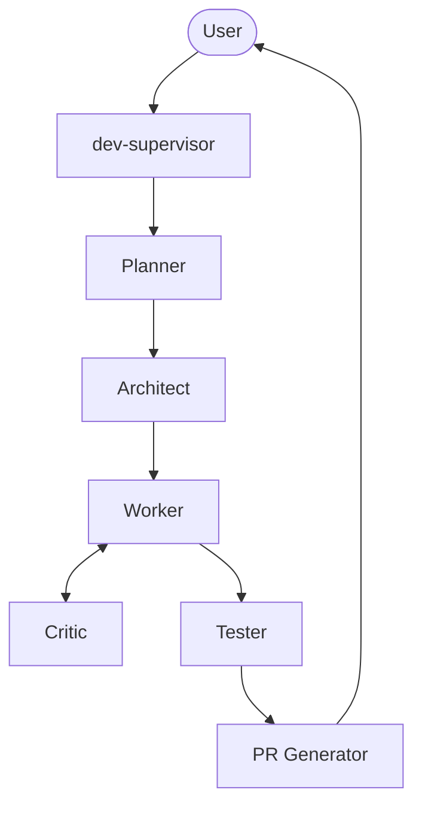
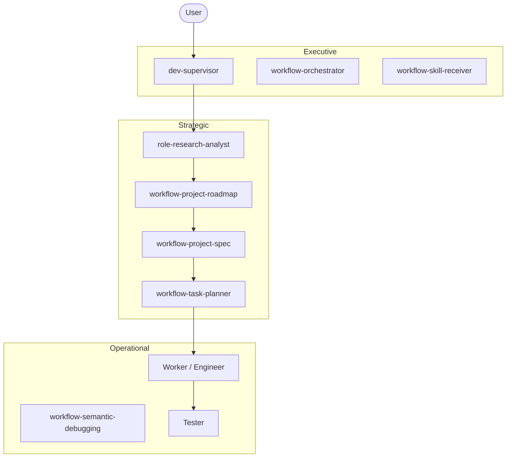
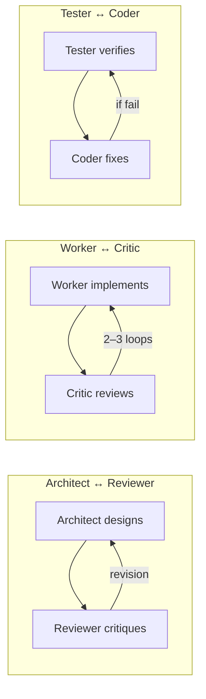
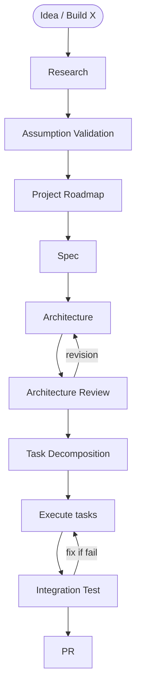

# Architecture Diagrams

Visual overview of the Agentic Dev framework. **Mermaid diagrams render on GitHub.**

---

## Main execution flow

```
User
  ↓
Supervisor (dev-supervisor)
  ↓
Planner
  ↓
Architect
  ↓
Worker ↔ Critic
  ↓
Tester
  ↓
PR Generator
```

---

## Mermaid: High-level pipeline



---

## Skill hierarchy (Executive → Strategic → Operational)



---

## Collaborative loops



---

## Full greenfield pipeline (Idea → PR)



---

## Stateful reasoning

```
read state  →  think  →  act  →  update state
     ↑                                    │
     └────────────────────────────────────┘
```

**Files:** `memory/project-state.md`, `memory/agent-messages.md`, `docs/system-docs/decision-log.md`
